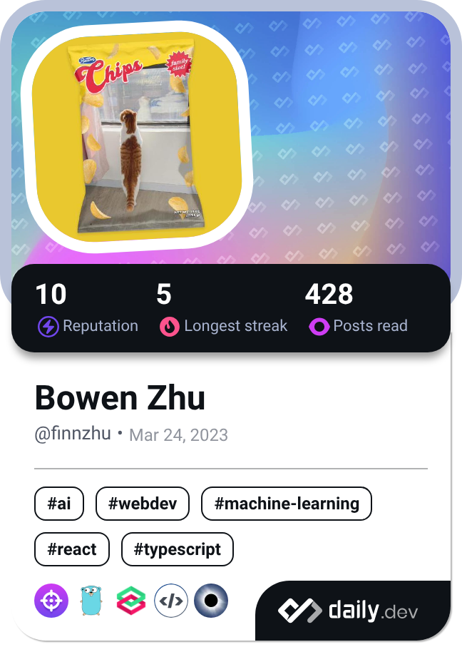

<h1> Hey! Nice to see you.</h1>

Welcome to my page!   

I'm [bowen zhu](https://github.com/Promacanthus)!

[Blog](https://promacanthus.netlify.app/)

#### About me

- 🔭 I’m currently working on cloud native.
- 🌱 I’m currently learning golang.
- 📫 How to reach me: promacanthus@gmail.com
<!--
- 👯 I’m looking to collaborate on ...
- 🤔 I’m looking for help with ...
- 💬 Ask me about ...
- 😄 Pronouns: ...
- ⚡ Fun fact: ...
-->

<a href="https://next.ossinsight.io/widgets/official/compose-user-dashboard-stats?user_id=26358883" target="_blank" style="display: block" align="center">
  <picture>
    <source media="(prefers-color-scheme: dark)" srcset="https://next.ossinsight.io/widgets/official/compose-user-dashboard-stats/thumbnail.png?user_id=26358883&image_size=auto&color_scheme=dark" width="771" height="auto">
    
  </picture>
</a>

Visitor count 

<h3>Where to find me</h3>

  

