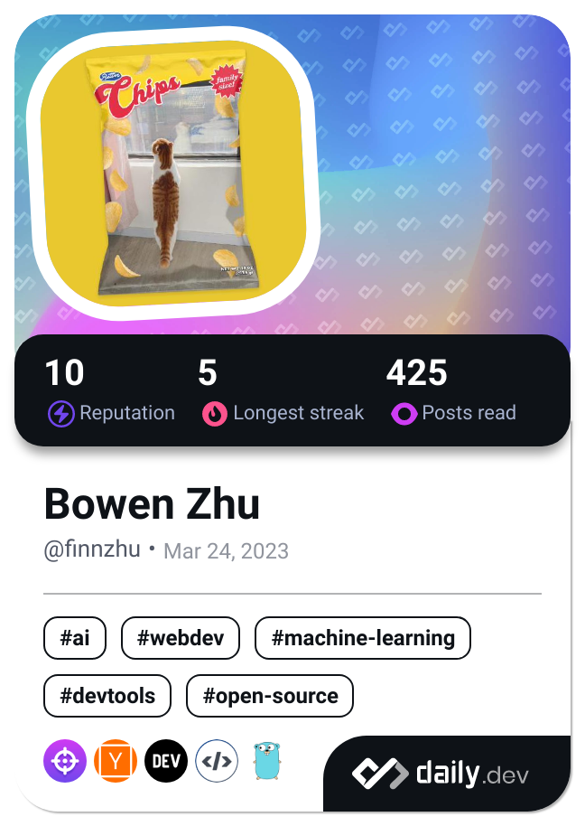

<h1> Hey! Nice to see you.</h1>

<!-- 
 -->

Welcome to my page!   

I'm [bowen zhu](https://github.com/Promacanthus)!

<!-- [Blog](https://promacanthus.netlify.app/) -->

<!--
**Promacanthus/Promacanthus** is a ✨ _special_ ✨ repository because its `README.md` (this file) appears on your GitHub profile.
-->
<!--
Here are some ideas to get you started:
-->

#### About me

- 🔭 I’m currently working on cloud native.
- 🌱 I’m currently learning golang.
- 📫 How to reach me: promacanthus@gmail.com
<!--
- 👯 I’m looking to collaborate on ...
- 🤔 I’m looking for help with ...
- 💬 Ask me about ...
- 😄 Pronouns: ...
- ⚡ Fun fact: ...
-->

<!--

-->

<!-- 
Visitor count 
 -->

|  |  |
| ------------- | ------------- |

<h3>Where to find me</h3>

  

